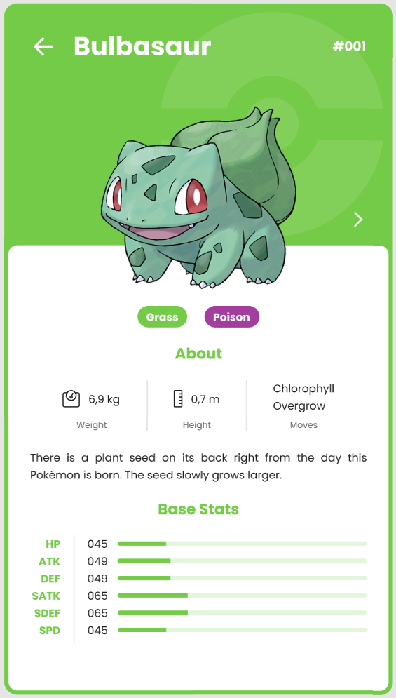
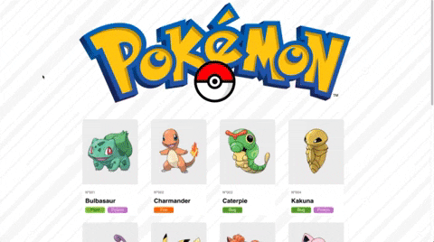

# Build your own Pokedex v2 - API calls - JS Advanced


In this project, you'll build a pokedex.In Pokemon lore, the Pokedex is a Pokemon dictionary that the characters carry with them. In this device, they can query the Pokemons and learn details about them, such as, abilities, type of Pokemon, strengths and weaknesses. **Students are encouraged to take examples online and implement them**

### Main goals
- Obtain information from third-party API
- Improve your knowledge of HTML5, CSS3 and ES6
- Learn more about how to integrate APIs and its interaction with the client
- Improve your skills in obtaining asynchronous information by using Fetch API
- Structure a web project in a clear and orderly manner

### General analysis
Create a **website** capable of:
- Search a pokemon by ID/name
- Create a general pokemon dashboard
- Display information of each pokemon in cards
- Navigate between `search` and `dashboard` views

## HTML + CSS
- You can adapt/reuse some parts of the previous pokedex that you've made during the course or start from scratch. Here the previous instructions: [pokedex | basic JS](https://refugeescode-materials.netlify.app/pokedex/assignment)
- Mobile-first

## Javascript
File: `script.js`

You'll use Pokeapi to GET all the information to complete the exercise
#### PokeAPI -> [API Docs](https://pokeapi.co/docs/v2)

### Exercise JS 1 - Searching a pokemon
- File: `search.html`
1. Develop a search field where users will search for Pokemon’s name or id.
   - Create input + button to search. 
   - Add a callback to the button event listener.
2. Make a request by Pokemon ID or name. PokeApi already can handle both.
   - There are some Pokemons that don’t exist but should, 999 doesn’t exist but 1000 does.
3. Display important information in the card. All this information is available on the first REST call to the API.
   - Name (Bulbasaur, Charizard, Pikachu)
   - Skills (Lighting-rod, static)
   - Type of Pokemon (Ghost, Poison, Fire)
   - Image (sprites)

   ```js
    ...
    other:{
    dream_world{
        front_default:"https://raw.githubusercontent.com/PokeAPI/sprites/master/sprites/pokemon/other/dream-world/132.svg"
        front_female:null
        front_default:"https://raw.githubusercontent.com/PokeAPI/sprites/master/sprites/pokemon/other/official-artwork/132.png"
    },
    official-artwork{
        front_default:"https://raw.githubusercontent.com/PokeAPI/sprites/master/sprites/pokemon/other/official-artwork/132.png"
    }
    }
    ...
   ```
   
4. WireFrame - Examples
(This is just a reference. It's not neccesary implement the same design)

    ### Search

    

    ### Cards

    
    


### Exercise JS 2 - Pokemon dashboard
- File: `dashboard.html`
1. Fetch 20 pokemons and paint them on the screen. You'll have to make a nested Fetch 
    - Step 1: Fetch (HTTP GET) the list of first 30 pokemon.

        `GET https://pokeapi.co/api/v2/pokemon?limit=20&offset=0`
    
    - Step 2: You'll need to iterate over the previous object obtained to make another fetch (HTTP GET). Examples:
        - [ Bulbasaur | GET https://pokeapi.co/api/v2/pokemon/1](https://pokeapi.co/api/v2/pokemon/1)
        - [Charmander | GET https://pokeapi.co/api/v2/pokemon/4](https://pokeapi.co/api/v2/pokemon/4)
        - [Squirtle | GET https://pokeapi.co/api/v2/pokemon/7](https://pokeapi.co/api/v2/pokemon/7)
    - **Important**: To make the nested fetch (HTTP GET) you'll need to iterate and transform data obtained on the original array, think about [map()](https://developer.mozilla.org/en-US/docs/Web/JavaScript/Reference/Global_Objects/Array/map) array method. You can also use another kind of iteration.

2. Display important information in the cards.
   - Name (Bulbasaur, Charizard, Pikachu)
   - Type of Pokemon (Ghost, Poison, Fire)
   - Image

3. WireFrame - Example (This is just a reference. It's not neccesary implement the same design)

    

### Useful tutorials
- [fetching-them-all-poke-api](https://medium.com/@sergio13prez/fetching-them-all-poke-api-62ca580981a2)

